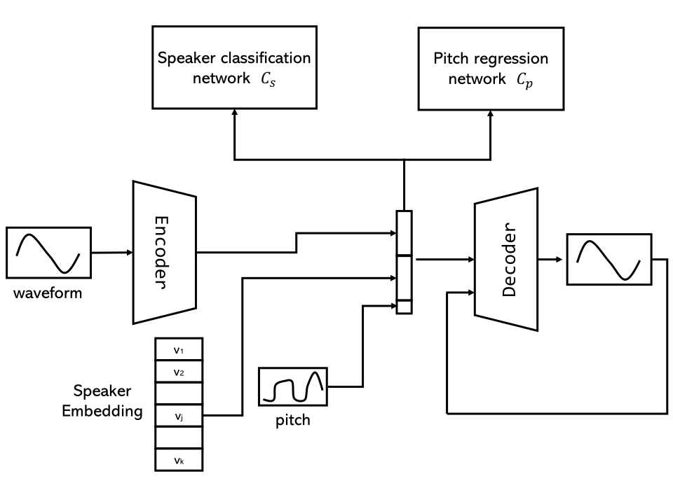

## The Architecture of Our Model

## Examples

---

Singing voice of JLEE: 
<audio controls="" preload="auto">
            <source src="wavs/Origin/JLEE-08.wav"></audio>

<table>
  <thead>
    <tr>
      <th>Target</th>
      <!-- th>Original voice</th-->
      <th><a href="https://arxiv.org/abs/1904.06590">Nachmani et al.</a></th>
      <th>Ours</th>
    </tr>
  </thead>
  <tbody>
    <tr>
      <td>VKOW</td>
      <!--td><audio controls="" preload="auto">
            <source src="wavs/Origin/JLEE-08.wav"></audio></td-->
      <td><audio controls="" preload="auto">
            <source src="wavs/USVC/JLEE-08-VKOW.wav"></audio></td>
      <td><audio controls="" preload="auto">
            <source src="wavs/Ours/JLEE-08-VKOW.wav"></audio></td>
    </tr>
    <tr>
      <td>JTAN</td>
      <!--td> </td-->
      <td><audio controls="" preload="auto">
            <source src="wavs/USVC/JLEE-08-JTAN.wav"></audio></td>
      <td><audio controls="" preload="auto">
            <source src="wavs/Ours/JLEE-08-JTAN.wav"></audio></td>
    </tr>
    <tr>
      <td>KENN</td>
      <!--td> </td-->
      <td><audio controls="" preload="auto">
            <source src="wavs/USVC/JLEE-08-KENN.wav"></audio></td>
      <td><audio controls="" preload="auto">
            <source src="wavs/Ours/JLEE-08-KENN.wav"></audio></td>
    </tr>
    <tr>
      <td>SAMF</td>
      <!--td> </td-->
      <td><audio controls="" preload="auto">
            <source src="wavs/USVC/JLEE-08-SAMF.wav"></audio></td>
      <td><audio controls="" preload="auto">
            <source src="wavs/Ours/JLEE-08-SAMF.wav"></audio></td>
    </tr>
    <tr>
      <td>ZHIY</td>
      <!--td> </td-->
      <td><audio controls="" preload="auto">
            <source src="wavs/USVC/JLEE-08-ZHIY.wav"></audio></td>
      <td><audio controls="" preload="auto">
            <source src="wavs/Ours/JLEE-08-ZHIY.wav"></audio></td>
    </tr>
  </tbody>
</table>

---

Singing voice of JTAN:

<audio controls="" preload="auto">
            <source src="wavs/Origin/JTAN-16.wav"></audio>

<table>
  <thead>
    <tr>
      <th>Target</th>
      <!-- th>Original voice</th-->
      <th>Nachmani et al.</th>
      <th>Ours</th>
    </tr>
  </thead>
  <tbody>
    <tr>
      <td>JLEE</td>
      <td><audio controls="" preload="auto">
            <source src="wavs/USVC/JTAN-16-JLEE.wav"></audio></td>
      <td><audio controls="" preload="auto">
            <source src="wavs/Ours/JTAN-16-JLEE.wav"></audio></td>
    </tr>
    <tr>
      <td>VKOW</td>
      <!--td> </td-->
      <td><audio controls="" preload="auto">
            <source src="wavs/USVC/JTAN-16-VKOW.wav"></audio></td>
      <td><audio controls="" preload="auto">
            <source src="wavs/Ours/JTAN-16-VKOW.wav"></audio></td>
    </tr>
    <tr>
      <td>KENN</td>
      <!--td> </td-->
      <td><audio controls="" preload="auto">
            <source src="wavs/USVC/JTAN-16-KENN.wav"></audio></td>
      <td><audio controls="" preload="auto">
            <source src="wavs/Ours/JTAN-16-KENN.wav"></audio></td>
    </tr>
    <tr>
      <td>SAMF</td>
      <!--td> </td-->
      <td><audio controls="" preload="auto">
            <source src="wavs/USVC/JTAN-16-SAMF.wav"></audio></td>
      <td><audio controls="" preload="auto">
            <source src="wavs/Ours/JTAN-16-SAMF.wav"></audio></td>
    </tr>
    <tr>
      <td>ZHIY</td>
      <!--td> </td-->
      <td><audio controls="" preload="auto">
            <source src="wavs/USVC/JTAN-16-ZHIY.wav"></audio></td>
      <td><audio controls="" preload="auto">
            <source src="wavs/Ours/JTAN-16-ZHIY.wav"></audio></td>
    </tr>
  </tbody>
</table>

