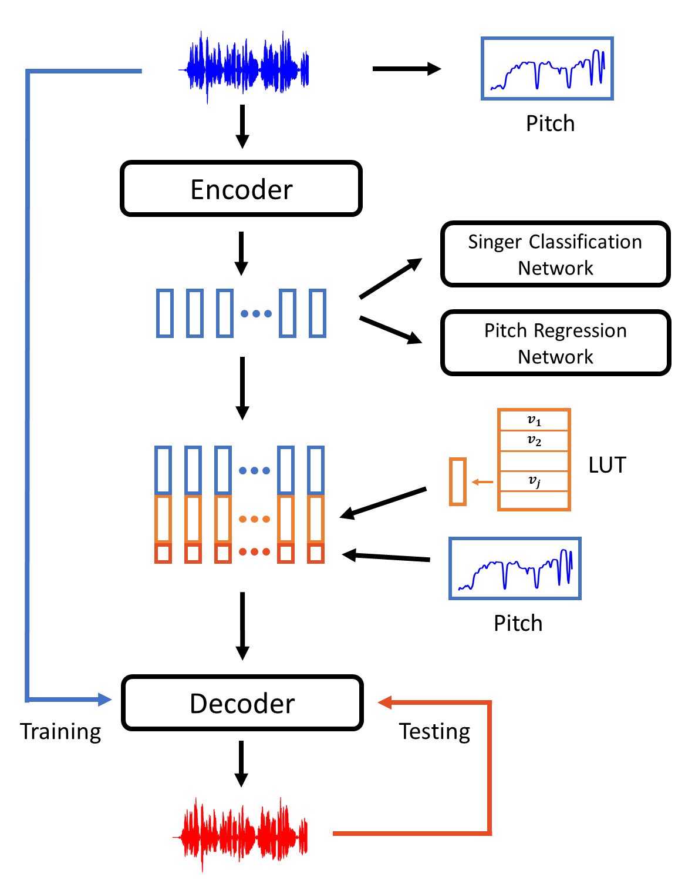
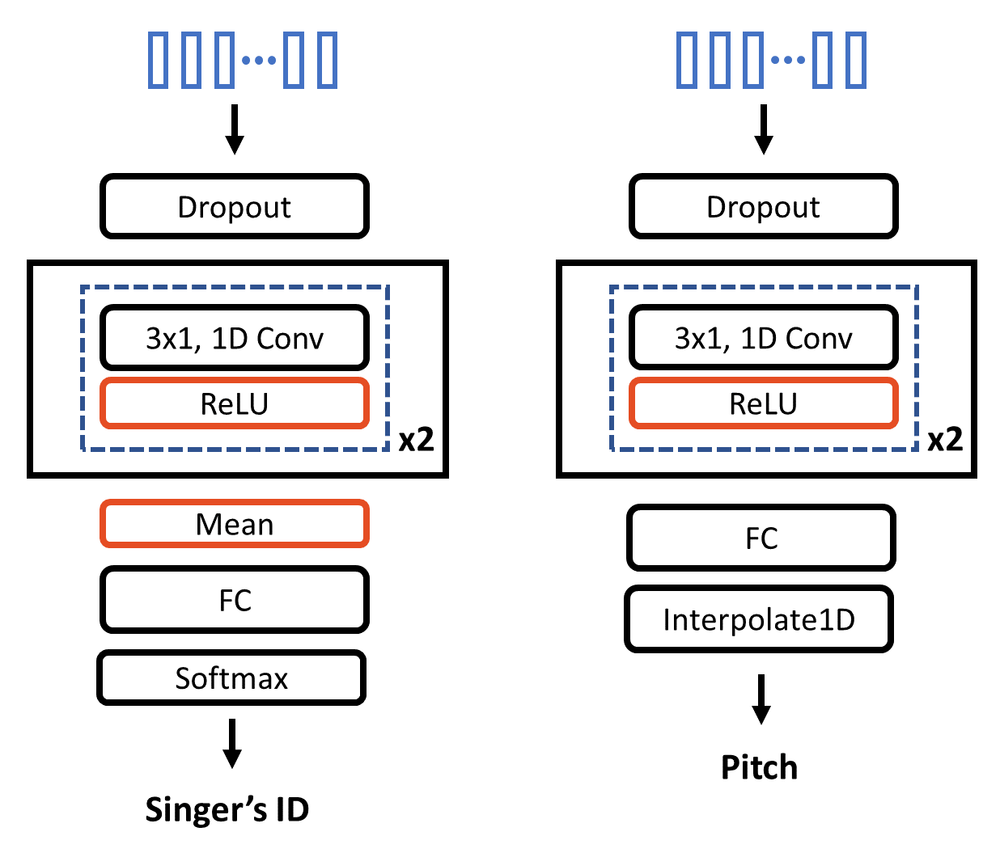

# 
PitchNet: Unsupervised Singing Voice Conversion with Pitch Adversarial Network

Chengqi Deng1, Chengzhu Yu2, Heng Lu2, Chao Weng2, Dong Yu2
 

1Zhejiang University, 2Tencent AI Lab
 

 

## Abstract

 Singing voice conversion is to convert a singer's voice to another one's voice without changing singing content. Recent work shows that unsupervised singing voice conversion can be achieved with an autoencoder-based approach [<a href="https://arxiv.org/abs/1904.06590">1</a>]. However, the converted singing voice can be easily out of key, showing that the existing approach can not model the pitch information precisely. In this paper, we propose to advance the existing unsupervised singing voice conversion method proposed in [<a href="https://arxiv.org/abs/1904.06590">1</a>] to achieve more accurate pitch translation and flexible pitch manipulation. Specifically, the proposed PitchNet added an adversarially trained pitch regression network to enforce the encoder network to learn pitch invariant phoneme representation, and a separate module to feed pitch extracted from the source audio to the decoder network. Our evaluation shows that the proposed method can greatly improve the quality of the converted singing voice (2.92vs3.75inMOS). We also demonstrate that the pitch of converted singing can be easily controlled during generation by changing the levels of extracted pitch before passing it to the decoder network.  

 

## The Architecture of Our Model

<table border="0">
  <tbody>
    <tr>
      <td></td>
      <td></td>
    </tr>
  </tbody>
</table>

 

## Examples

---

Singing voice of VKOW: 

<audio controls="" preload="auto">
            <source src="wavs/Origin/VKOW-11.wav"></audio>

<table align="center">
  <thead>
    <tr>
      <th>Target</th>
      <!-- th>Original voice</th-->
      <th><a href="https://arxiv.org/abs/1904.06590">Nachmani et al.</a></th>
      <th>Ours</th>
    </tr>
  </thead>
  <tbody>
    <tr>
      <td>JLEE</td>
      <!--td><audio controls="" preload="auto">
            <source src="wavs/Origin/JLEE-08.wav"></audio></td-->
      <td><audio controls="" preload="auto">
            <source src="wavs/USVC/VKOW-11-JLEE.wav"></audio></td>
      <td><audio controls="" preload="auto">
            <source src="wavs/Ours/VKOW-11-JLEE.wav"></audio></td>
    </tr>
    <tr>
      <td>JTAN</td>
      <!--td> </td-->
      <td><audio controls="" preload="auto">
            <source src="wavs/USVC/VKOW-11-JTAN.wav"></audio></td>
      <td><audio controls="" preload="auto">
            <source src="wavs/Ours/VKOW-11-JTAN.wav"></audio></td>
    </tr>
    <tr>
      <td>KENN</td>
      <!--td> </td-->
      <td><audio controls="" preload="auto">
            <source src="wavs/USVC/VKOW-11-KENN.wav"></audio></td>
      <td><audio controls="" preload="auto">
            <source src="wavs/Ours/VKOW-11-KENN.wav"></audio></td>
    </tr>
    <tr>
      <td>SAMF</td>
      <!--td> </td-->
      <td><audio controls="" preload="auto">
            <source src="wavs/USVC/VKOW-11-SAMF.wav"></audio></td>
      <td><audio controls="" preload="auto">
            <source src="wavs/Ours/VKOW-11-SAMF.wav"></audio></td>
    </tr>
    <tr>
      <td>ZHIY</td>
      <!--td> </td-->
      <td><audio controls="" preload="auto">
            <source src="wavs/USVC/VKOW-11-ZHIY.wav"></audio></td>
      <td><audio controls="" preload="auto">
            <source src="wavs/Ours/VKOW-11-ZHIY.wav"></audio></td>
    </tr>
  </tbody>
</table>
----

Singing voice of JLEE: 

<audio controls="" preload="auto">
            <source src="wavs/Origin/JLEE-08.wav"></audio>

<table>
  <thead>
    <tr>
      <th>Target</th>
      <!-- th>Original voice</th-->
      <th><a href="https://arxiv.org/abs/1904.06590">Nachmani et al.</a></th>
      <th>Ours</th>
    </tr>
  </thead>
  <tbody>
    <tr>
      <td>VKOW</td>
      <!--td><audio controls="" preload="auto">
            <source src="wavs/Origin/JLEE-08.wav"></audio></td-->
      <td><audio controls="" preload="auto">
            <source src="wavs/USVC/JLEE-08-VKOW.wav"></audio></td>
      <td><audio controls="" preload="auto">
            <source src="wavs/Ours/JLEE-08-VKOW.wav"></audio></td>
    </tr>
    <tr>
      <td>JTAN</td>
      <!--td> </td-->
      <td><audio controls="" preload="auto">
            <source src="wavs/USVC/JLEE-08-JTAN.wav"></audio></td>
      <td><audio controls="" preload="auto">
            <source src="wavs/Ours/JLEE-08-JTAN.wav"></audio></td>
    </tr>
    <tr>
      <td>KENN</td>
      <!--td> </td-->
      <td><audio controls="" preload="auto">
            <source src="wavs/USVC/JLEE-08-KENN.wav"></audio></td>
      <td><audio controls="" preload="auto">
            <source src="wavs/Ours/JLEE-08-KENN.wav"></audio></td>
    </tr>
    <tr>
      <td>SAMF</td>
      <!--td> </td-->
      <td><audio controls="" preload="auto">
            <source src="wavs/USVC/JLEE-08-SAMF.wav"></audio></td>
      <td><audio controls="" preload="auto">
            <source src="wavs/Ours/JLEE-08-SAMF.wav"></audio></td>
    </tr>
    <tr>
      <td>ZHIY</td>
      <!--td> </td-->
      <td><audio controls="" preload="auto">
            <source src="wavs/USVC/JLEE-08-ZHIY.wav"></audio></td>
      <td><audio controls="" preload="auto">
            <source src="wavs/Ours/JLEE-08-ZHIY.wav"></audio></td>
    </tr>
  </tbody>
</table>
---

Singing voice of JTAN:

<audio controls="" preload="auto">
            <source src="wavs/Origin/JTAN-16.wav"></audio>

<table>
  <thead>
    <tr>
      <th>Target</th>
      <!-- th>Original voice</th-->
      <th>Nachmani et al.</th>
      <th>Ours</th>
    </tr>
  </thead>
  <tbody>
    <tr>
      <td>JLEE</td>
      <td><audio controls="" preload="auto">
            <source src="wavs/USVC/JTAN-16-JLEE.wav"></audio></td>
      <td><audio controls="" preload="auto">
            <source src="wavs/Ours/JTAN-16-JLEE.wav"></audio></td>
    </tr>
    <tr>
      <td>VKOW</td>
      <!--td> </td-->
      <td><audio controls="" preload="auto">
            <source src="wavs/USVC/JTAN-16-VKOW.wav"></audio></td>
      <td><audio controls="" preload="auto">
            <source src="wavs/Ours/JTAN-16-VKOW.wav"></audio></td>
    </tr>
    <tr>
      <td>KENN</td>
      <!--td> </td-->
      <td><audio controls="" preload="auto">
            <source src="wavs/USVC/JTAN-16-KENN.wav"></audio></td>
      <td><audio controls="" preload="auto">
            <source src="wavs/Ours/JTAN-16-KENN.wav"></audio></td>
    </tr>
    <tr>
      <td>SAMF</td>
      <!--td> </td-->
      <td><audio controls="" preload="auto">
            <source src="wavs/USVC/JTAN-16-SAMF.wav"></audio></td>
      <td><audio controls="" preload="auto">
            <source src="wavs/Ours/JTAN-16-SAMF.wav"></audio></td>
    </tr>
    <tr>
      <td>ZHIY</td>
      <!--td> </td-->
      <td><audio controls="" preload="auto">
            <source src="wavs/USVC/JTAN-16-ZHIY.wav"></audio></td>
      <td><audio controls="" preload="auto">
            <source src="wavs/Ours/JTAN-16-ZHIY.wav"></audio></td>
    </tr>
  </tbody>
</table>

 

**Converted results of different pitch as input**

\* *Convert from VKOW to JLEE*

Source:  
<audio controls="" preload="auto">
            <source src="wavs/Origin/VKOW-11.wav"></audio>

<table>
  <thead>
    <tr>
      <th>Input Pitch</th>
      <th>Output</th>
    </tr>
  </thead>
  <tbody>
    <tr>
      <td>pitch x 1.0</td>
      <td><audio controls="" preload="auto">
            <source src="wavs/Pitch/VKOW-11-JLEE-1.0.wav"></audio></td>
    </tr>
    <tr>
      <td>pitch x 0.7</td>
      <td><audio controls="" preload="auto">
            <source src="wavs/Pitch/VKOW-11-JLEE-0.7.wav"></audio></td>
    </tr>
    <tr>
      <td>pitch x 1.2</td>
      <td><audio controls="" preload="auto">
            <source src="wavs/Pitch/VKOW-11-JLEE-1.2.wav"></audio></td>
    </tr>
  </tbody>
</table>